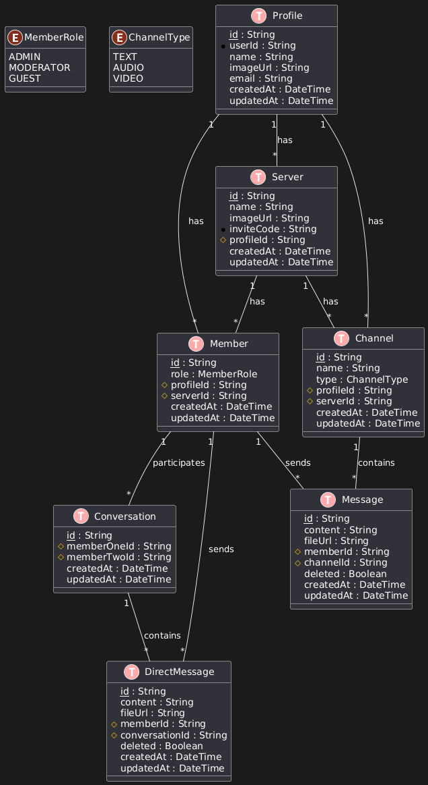

# Discord Clone


A modern, feature-rich Discord clone built with Next.js, TypeScript, and shadcn/ui components. This project aims to replicate the core functionality and sleek design of Discord while showcasing the power of Next.js and related technologies.

## Features

- Real-time messaging
- Server and channel management
- User authentication with Clerk
- Responsive design
- Dark mode support
- File uploads with uploadthing
- And much more!

## Tech Stack

- [Next.js](https://nextjs.org/)
- [React](https://reactjs.org/)
- [TypeScript](https://www.typescriptlang.org/)
- [Tailwind CSS](https://tailwindcss.com/)
- [shadcn/ui](https://ui.shadcn.com/)
- [Prisma](https://www.prisma.io/)
- [Clerk](https://clerk.dev/)
- [Zustand](https://github.com/pmndrs/zustand)
- [Zod](https://github.com/colinhacks/zod)
- [React Hook Form](https://react-hook-form.com/)
- [uploadthing](https://uploadthing.com/)
- [Livekit](https://livekit.io/)

## Database Schema



## Getting Started

### Prerequisites

- Node.js (v14 or later)
- npm or yarn
- A Clerk account for authentication
- A database (e.g., PostgreSQL)
- An uploadthing account for file uploads

### Installation

1. Clone the repository:

   ```
   git clone https://github.com/meharsulaiman/discord-clone.git
   cd discord-clone
   ```

2. Install dependencies:

   ```
   npm install
   # or
   yarn install
   ```

3. Set up environment variables:
   Create a `.env` file in the root directory and add the necessary environment variables. Use the following `.env.example` as a template:

   ```
   NEXT_PUBLIC_CLERK_PUBLISHABLE_KEY=
   CLERK_SECRET_KEY=

   NEXT_PUBLIC_CLERK_SIGN_IN_URL=/sign-in
   NEXT_PUBLIC_CLERK_SIGN_UP_URL=/sign-up
   NEXT_PUBLIC_CLERK_AFTER_SIGN_IN_URL=/
   NEXT_PUBLIC_CLERK_AFTER_SIGN_UP_URL=/

   DATABASE_URL=""

   UPLOADTHING_SECRET=''
   UPLOADTHING_APP_ID=''
   ```

   Make sure to fill in the values for each variable:

   - Get the Clerk keys from your Clerk dashboard
   - Set up your database and add the connection string to `DATABASE_URL`
   - Obtain the uploadthing credentials from your uploadthing dashboard

4. Set up the database:

   ```
   npx prisma generate
   npx prisma db push
   ```

5. Run the development server:

   ```
   npm run dev
   # or
   yarn dev
   ```

6. Open [http://localhost:3000](http://localhost:3000) in your browser to see the result.

## Available Scripts

- `npm run dev` or `yarn dev`: Starts the development server
- `npm run build` or `yarn build`: Builds the app for production
- `npm start` or `yarn start`: Runs the built app in production mode
- `npm run lint` or `yarn lint`: Runs the linter to check for code quality issues

## Contributing

Contributions are welcome! Please feel free to submit a Pull Request.

## License

This project is open source and available under the [MIT License](LICENSE).

## Acknowledgements

- [Shadcn](https://twitter.com/shadcn) for the amazing shadcn/ui components
- The Next.js team for their fantastic framework
- All the creators and maintainers of the libraries used in this project
